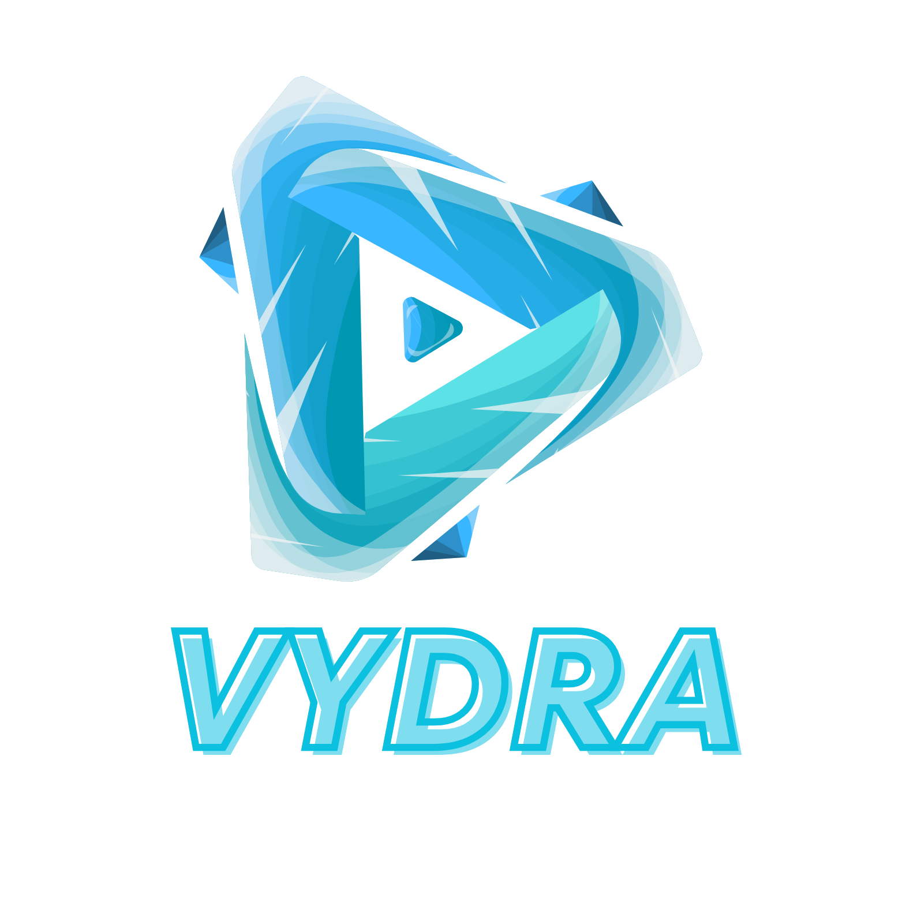

# Vydra: Flutter Android App for YouTube Streaming



**Vydra** (a fusion of "Video" and "Hydra") is a powerful, multi-featured Android application built with Flutter, designed to deliver a seamless and feature-rich YouTube streaming experience. Leveraging the YouTube Data API, Vydra enables users to explore, watch, and manage YouTube content with an intuitive interface and optimal performance.

## Key Features
- **Video Streaming**: Watch YouTube videos in high quality directly within the app.
- **Advanced Search**: Quickly search for videos, channels, or playlists using the YouTube Data API.
- **Playlist Management**: Create, edit, and manage YouTube playlists directly from the app.
- **Responsive UI**: Modern Flutter-based design optimized for Android devices.
- **Interactive Features**: Support for liking, commenting, and sharing videos for an engaging experience.
- **Personalization**: Video recommendations based on user watch history.
- **Firebase Integration**: Authentication and data management using Firebase.
- **Offline Capabilities**: Cache videos and manage downloads with video_thumbnail and path_provider.
- **Audio Playback**: Stream audio using audioplayers.
- **Custom Animations**: Enhanced UI with animate_do and shimmer effects.

## Technologies Used
- **Flutter**: UI framework for building responsive Android applications.
- **YouTube Data API**: Fetches real-time video, channel, and playlist data.
- **Dart**: Programming language for efficient app logic.
- **REST API**: Integration with YouTube endpoints for streaming and interaction functionalities.
- **Firebase**: Authentication and core services with firebase_core and firebase_auth.
- **Google Sign-In**: Seamless login with google_sign_in.
- **HTTP**: Network requests with http.
- **Cached Network Image**: Efficient image loading with cached_network_image.
- **YouTube Player Flutter**: Video playback with youtube_player_flutter.
- **Shared Preferences**: Local storage with shared_preferences.
- **Animate Do**: Animations with animate_do.
- **Google Fonts**: Custom typography with google_fonts.
- **Shimmer**: Loading effects with shimmer.
- **Path Provider**: File management with path_provider.
- **Share Plus**: Sharing capabilities with share_plus.
- **Open Filex**: File opening with open_filex.
- **Video Thumbnail**: Generate video thumbnails with video_thumbnail.
- **Video Player**: Video playback with video_player.
- **Connectivity Plus**: Network status with connectivity_plus.
- **Intl**: Internationalization with intl.
- **Syncfusion Flutter Datepicker**: Date picking with syncfusion_flutter_datepicker.
- **Package Info Plus**: App info with package_info_plus.
- **URL Launcher**: Launch URLs with url_launcher.
- **Audioplayers**: Audio playback with audioplayers.
- **Permission Handler**: Handle permissions with permission_handler.
- **Particles Flutter**: Visual effects with particles_flutter.

## Prerequisites
Before getting started, ensure you have:
- [Flutter SDK](https://flutter.dev/docs/get-started/install) (latest version)
- [Dart](https://dart.dev/get-dart) (included with Flutter)
- [Android Studio](https://developer.android.com/studio) or another IDE for Flutter development
- [YouTube Data API Key](https://developers.google.com/youtube/v3/getting-started) from Google Cloud Console
- [Firebase Project](https://firebase.google.com/) set up to obtain the `google-services.json` file

## Installation
1. **Clone the Repository**
   ```bash
   git clone https://github.com/username/Vydra-Flutter-Android-For-Youtube-Stream.git
   cd Vydra-Flutter-Android-For-Youtube-Stream
   ```

2. **Create a Firebase Project**
   - Go to the [Firebase Console](https://console.firebase.google.com/) and create a new project.
   - Add an Android app to your Firebase project and follow the instructions to download the `google-services.json` file.
   - Place the `google-services.json` file in the `android/app` directory of your project.

3. **Clean the Project**
   ```bash
   flutter clean
   flutter pub cache clean
   ```

4. **Configure API Key**
   - Replace `YOUR_API_KEY_HERE` in `lib/api/api_manager.dart` with your valid YouTube API key.

5. **Run the App**
   ```bash
   flutter pub get
   flutter run
   ```

## Project Structure
```
Vydra-Flutter-Android-For-Youtube-Stream/
├── android/                # Android configuration
├── ios/                    # iOS configuration (optional)
├── lib/                    # Main source code
│   ├── api/                # API manager (api_manager.dart, api_manager_copy.dart)
│   ├── auth/               # Authentication service (auth_service.dart)
│   ├── component/          # Navigation bar (custom_bottom_navigation_bar.dart, NavBar)
│   ├── home/               # Home screen (AboutApp, about_screen.dart)
│   ├── channelDetail/      # Channel details screen (channel_details_screen.dart)
│   ├── playlists/          # Playlists screen (playlist_videos_screen.dart)
│   ├── settings/           # Settings screen (checkUpdate, settings_screen.dart)
│   ├── downloadManager/    # Download manager screen (download_manager_screen.dart)
│   ├── subscription/       # Subscription screen (subscription_screen.dart)
│   ├── videoList/          # Video list screen (video_list_screen.dart)
│   ├── videoPlayer/        # Video player screen (video_player_screen.dart)
│   ├── splashScreen/       # Splash screen (splash_screen.dart)
│   └── main.dart           # Main entry point
├── pubspec.yaml            # Project dependencies
└── README.md               # This documentation
```

## How to Use
1. **Explore Videos**: Open the app and use the search bar to find your favorite videos or channels.
2. **Watch Videos**: Tap a video to play it in the built-in player.
3. **Manage Playlists**: Sign in with your Google account to create or edit playlists.
4. **Interact**: Like, comment, or share videos directly from the app.
5. **Settings**: Configure app preferences and check for updates.
6. **Downloads**: Manage offline video downloads.

## Contributing
We welcome contributions to make Vydra even better! Follow these steps:
1. Fork this repository.
2. Create a new branch: `git checkout -b your-feature`.
3. Make changes and commit: `git commit -m 'Add your-feature'`.
4. Push to the branch: `git push origin your-feature`.
5. Create a Pull Request on GitHub.

## Contact
For questions or support, reach out to us at:
- Email: hendriansyahrizkysetiawan@gmail.com
- GitHub Issues: [Create an Issue](https://github.com/kyy-95631488/Vydra-Flutter-Android-For-Youtube-Stream/issues)

**Vydra** — As powerful as a Hydra, flexible for all your streaming needs!